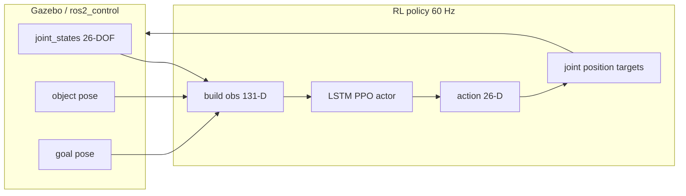

# SimToolReal — Project Recap for Gazebo / Policy Deployment

This document summarizes the **simtoolreal** repository for an external agent that will set up a **Gazebo (or Gazebo-compatible) simulation** with the **UR5e arm + Delto DG5F hand**, and run a policy trained in **Isaac Gym**.

---

## 1. What this repository does

**SimToolReal** trains and deploys an **object-centric RL policy** for dexterous **tool manipulation**: the robot grasps a tool, lifts it, and moves it so tool keypoints follow a goal trajectory (hammer swing, marker draw, etc.).

Main components:

| Area | Path | Role |
|------|------|------|
| Simulation & training | `isaacgymenvs/` | Isaac Gym env (`SimToolReal`), Hydra configs, PPO/SAPG training |
| Robot & object assets | `assets/urdf/` | URDFs, meshes, combined arm+hand models |
| Benchmark | `dextoolbench/` | Tasks, objects, eval scripts, interactive Viser demo |
| Deployment | `deployment/` | ROS nodes: policy, goal pose, Isaac sim bridge, visualization |
| RL library | `rl_games/` | PPO, LSTM actor, asymmetric critic |
| Checkpoints | `pretrained_policy/`, `train_dir/` | `config.yaml` + `model.pth` |

Paper / upstream README: [README.md](README.md).

---

## 2. Current robot setup (training)

Training is configured for **UR5e (6 DOF) + Delto DG5F left hand (20 DOF)**.

Primary config: [`isaacgymenvs/cfg/task/SimToolReal.yaml`](isaacgymenvs/cfg/task/SimToolReal.yaml)

| Setting | Value |
|---------|--------|
| Combined URDF | `urdf/ur5e_delto_description/ur5e_left_dg5f.urdf` |
| Arm DOFs | `armDofs: 6` |
| Hand DOFs | 20 (5 fingers × 4 revolute joints) |
| Total actions | **26** |
| End-effector link | `wrist_3_link` |
| Palm link | `wrist_3_link` (+ offset `palmOffset: [0, 0, 0.16]`) |
| Default arm pose (rad) | `[-1.5708, -1.571, 1, 0.5, 1.571, -1.571]` |
| Control rate | 60 Hz (`controlFrequencyInv: 1`) |
| `dofSpeedScale` | 1.5 |
| `armMovingAverage` / `handMovingAverage` | 0.1 |

**Original paper robot** (still referenced in deployment utilities): **Kuka IIWA14 (7 DOF) + Sharpa HA4 (22 DOF)** → 29 DOF. See [§8 Migration gaps](#8-important-gaps-for-gazebo--ros-deployment).

---

## 3. Where to find URDF files

### 3.1 Combined arm + hand (Isaac Gym training — use this as reference)

```
assets/urdf/ur5e_delto_description/ur5e_left_dg5f.urdf
```

- **26 revolute joints** total (6 arm + 20 hand).
- Mesh paths are **repo-relative** (e.g. `urdf/universal_robot/ur_description/meshes/ur5e/...`), suitable for Isaac Gym without ROS `package://` resolution.
- Hand is mounted on `wrist_3` via fixed joints (`wrist_3-flange`, `flange-tool0`, `lj_dg_base`, …).

**Arm joint names (in action vector indices 0–5):**

- `shoulder_pan_joint`, `shoulder_lift_joint`, `elbow_joint`, `wrist_1_joint`, `wrist_2_joint`, `wrist_3_joint`

**Hand joint names (indices 6–25):**

- `lj_dg_1_1` … `lj_dg_1_4`, `lj_dg_2_1` … `lj_dg_2_4`, …, `lj_dg_5_1` … `lj_dg_5_4`

**Fingertip rigid bodies** (used in rewards/observations in `env.py`):

- `ll_dg_1_4`, `ll_dg_2_4`, `ll_dg_3_4`, `ll_dg_4_4`, `ll_dg_5_4`

### 3.2 UR5e only (Gazebo / ROS)

```
assets/urdf/universal_robot/ur_description/urdf/ur5e.urdf
assets/urdf/universal_robot/ur_description/urdf/ur5e.xacro
assets/urdf/universal_robot/ur_gazebo/          # Classic Gazebo bringup (ROS1-style)
assets/urdf/universal_robot/ur_gazebo/launch/ur5e_bringup.launch
```

### 3.3 Delto DG5F only (ROS 2 + Ignition Gazebo)

Vendor stack (Tesollo), vendored under:

```
assets/urdf/delto_m_ros2/
```

| Package | Purpose |
|---------|---------|
| `dg_description/` | Base URDF/xacro + meshes (`dg5f_left.urdf`, `dg5f_left.xacro`, …) — uses `package://dg_description/...` |
| `dg5f_gz/` | **Ignition Gazebo** sim + `ros2_control` (`dg5f_left_gz.xacro`, launch files) |
| `dg5f_driver/` | Hardware / ros2_control driver configs |

**Hand-only Gazebo (Ignition):**

```bash
# From vendor README — requires ROS 2 workspace with these packages
ros2 launch dg5f_gz dg5f_left_gz.launch.py
```

Paths:

- `assets/urdf/delto_m_ros2/dg5f_gz/urdf/dg5f_left_gz.xacro`
- `assets/urdf/delto_m_ros2/dg5f_gz/config/dg5f_left_gz_controller.yaml`

**Note:** Vendor sim targets **Ignition Gazebo (gz)**, not classic Gazebo. For a **single UR5e+hand** scene you will likely need a **new combined xacro/urdf** (arm from `universal_robot` + mount from `ur5e_left_dg5f.urdf` or xacro includes), plus `ros2_control` tags for all 26 actuated joints.

### 3.4 Other robot variants in repo

| Robot | URDF |
|-------|------|
| IIWA + Sharpa (original) | `assets/urdf/kuka_sharpa_description/iiwa14_left_sharpa_adjusted_restricted.urdf` |
| UR5e + Sharpa | `assets/urdf/ur5e_sharpa_description/ur5e_left_sharpa.urdf` |
| DexToolBench tools | `assets/urdf/dextoolbench/<category>/<object>/<object>.urdf` |
| Table | `assets/urdf/table_narrow.urdf` (see `SimToolReal.yaml` → `env.asset.table`) |

### 3.5 Object assets (tools)

Training uses procedural handle tools (`objectName: handle_head_primitives`) or DexToolBench objects under `assets/urdf/dextoolbench/`. For a first Gazebo test, a simple box/cylinder tool mesh is enough; match approximate scale from task config (`objectBaseSize`, `fixedSize` in yaml).

---

## 4. Configuration files (training)

### 4.1 Task environment

| File | Description |
|------|-------------|
| [`isaacgymenvs/cfg/task/SimToolReal.yaml`](isaacgymenvs/cfg/task/SimToolReal.yaml) | Main env: robot path, rewards, obs list, sim params |
| [`isaacgymenvs/cfg/task/SimToolRealLSTMAsymmetric.yaml`](isaacgymenvs/cfg/task/SimToolRealLSTMAsymmetric.yaml) | Extends above for LSTM + asymmetric critic |

**Observation list** (`obsList` — actor sees these):

```yaml
["joint_pos", "joint_vel", "prev_action_targets", "palm_pos", "palm_rot",
 "object_rot", "fingertip_pos_rel_palm", "keypoints_rel_palm",
 "keypoints_rel_goal", "object_scales"]
```

**Approximate actor observation size** (UR5e + Delto, 26 DOF, 5 fingertips, 4 keypoints):

| Block | Dim |
|-------|-----|
| joint_pos, joint_vel, prev_action_targets | 26 × 3 = 78 |
| palm_pos, palm_rot, object_rot | 3 + 4 + 4 = 11 |
| fingertip_pos_rel_palm | 5 × 3 = 15 |
| keypoints_rel_palm, keypoints_rel_goal | 4 × 3 × 2 = 24 |
| object_scales | 3 |
| **Total** | **131** |

Verify at runtime from your checkpoint’s `config.yaml` (`task.env.numObservations`) — local smoke tests have also reported other sizes when configs differ.

**Privileged critic** uses extra terms from `stateList` (includes palm/object velocity, lifted flag, progress, etc.).

### 4.2 Training / algorithm

| File | Description |
|------|-------------|
| [`isaacgymenvs/cfg/train/SimToolRealLSTMAsymmetricPPO.yaml`](isaacgymenvs/cfg/train/SimToolRealLSTMAsymmetricPPO.yaml) | LSTM actor, asymmetric value net |
| [`isaacgymenvs/cfg/train/SimToolRealPPO.yaml`](isaacgymenvs/cfg/train/SimToolRealPPO.yaml) | Base PPO + SAPG-related settings |
| [`isaacgymenvs/cfg/config.yaml`](isaacgymenvs/cfg/config.yaml) | Top-level Hydra: devices, wandb, checkpoint |
| [`isaacgymenvs/launch_training.py`](isaacgymenvs/launch_training.py) | Convenience launcher (num_envs, wandb, checkpoint, forces) |

Default training task name: **`SimToolRealLSTMAsymmetric`** (set in `launch_training.py`).

### 4.3 Launch training

```bash
cd /path/to/simtoolreal
python isaacgymenvs/launch_training.py \
  --custom-experiment-name my_run \
  --num-envs 12288
```

Fine-tune from checkpoint:

```bash
python isaacgymenvs/launch_training.py \
  --custom-experiment-name finetune \
  --checkpoint path/to/model.pth \
  --num-envs 12288
```

Checkpoints typically land under:

```
train_dir/simtoolreal/<YYYY-MM-DD>/<experiment_name>/runs/00_<experiment_name>/
  ├── config.yaml    # full resolved Hydra config — use for deployment dims
  ├── model.pth      # or best/model.pth
  └── ...
```

---

## 5. Policy interface (what Gazebo must implement)

### 5.1 Action → joint targets (60 Hz)

Implemented in [`isaacgymenvs/tasks/simtoolreal/env.py`](isaacgymenvs/tasks/simtoolreal/env.py) (`pre_physics_step`). Actions are **normalized roughly in [-1, 1]** from the policy.

**Arm (first `armDofs` = 6 components):**

- Not absolute positions: **increment previous target**  
  `target_arm = prev_arm + dofSpeedScale * dt * action_arm`  
  then **EMA** with `armMovingAverage`, clamp to joint limits.

**Hand (remaining 20 components):**

- Map action from [-1,1] to **[q_min, q_max]** per joint (`scale()`), then **EMA** with `handMovingAverage`, clamp.

Reference Python (IIWA+Sharpa, 29 DOF) in [`isaacgymenvs/utils/observation_action_utils_sharpa.py`](isaacgymenvs/utils/observation_action_utils_sharpa.py) — functions `compute_joint_pos_targets`, `compute_observation`. **These are still hardcoded for 29-DOF IIWA+Sharpa**; for UR5e+Delto you should mirror `env.py` logic with **26 DOFs** and correct link names.

### 5.2 Observations

Built inside Isaac from rigid-body states (not from `observation_action_utils_sharpa` in production). For Gazebo deployment you must reproduce the same vector from:

- Joint positions/velocities (26)
- Previous command targets (26)
- Palm pose (from FK or `wrist_3_link` + `palmOffset`)
- Object orientation (3D pose from sim or fake perception)
- Fingertip positions relative to palm (5 × 3)
- Object keypoints relative to palm and to goal (4 × 3 each) — keypoint layout is fixed offsets in `_object_keypoint_offsets()` in `env.py`
- Object scale (3)

**Object & goal pose:** In full stack, `/robot_frame/current_object_pose` and `/robot_frame/goal_object_pose` (see deployment). In sim-only tests, poses can come from Gazebo ground truth.

### 5.3 Running the neural network

[`deployment/rl_player.py`](deployment/rl_player.py):

- Loads `config.yaml` + `model.pth` via **rl_games** `PpoPlayerContinuous`.
- LSTM: call `player.init_rnn()` and reset on episode boundary.
- **SAPG:** append **one extra scalar** `50.0` to the observation before inference:

```python
obs = torch.cat([obs, 50.0 + torch.zeros((batch, 1), device=device)], dim=1)
```

Use **`deterministic_actions=True`** for deployment unless exploring.

Always read **`numObservations` / `numActions`** from the **same** `config.yaml` as the checkpoint.

### 5.4 Control loop diagram



---

## 6. Existing deployment stack (ROS)

Designed for **real robot** or **Isaac sim2sim**; topics still use **iiwa/sharpa** names.

| Node | File | Role |
|------|------|------|
| RL policy | [`deployment/rl_policy_node.py`](deployment/rl_policy_node.py) | Obs → policy → `/iiwa/joint_cmd`, `/sharpa/joint_cmd` |
| Goal pose | [`deployment/goal_pose_node.py`](deployment/goal_pose_node.py) | Task trajectory → goal object pose |
| Isaac bridge | [`deployment/isaac/isaac_env_node.py`](deployment/isaac/isaac_env_node.py) | Sim2sim in Isaac Gym |
| Visualization | [`deployment/visualization_node.py`](deployment/visualization_node.py) | Viser debug |

**ROS topics (legacy naming):**

- `/iiwa/joint_states`, `/iiwa/joint_cmd` — arm (7 joints in original setup)
- `/sharpa/joint_states`, `/sharpa/joint_cmd` — hand (22 joints)
- `/robot_frame/current_object_pose`, `/robot_frame/goal_object_pose`

For Gazebo you will either **remap topics** or **fork `rl_policy_node.py`** to publish to `ros2_control` controllers (e.g. `/joint_trajectory` or per-joint commands).

**Interactive eval (Isaac Gym + Viser):**

```bash
python dextoolbench/eval_interactive.py \
  --config-path path/to/config.yaml \
  --checkpoint-path path/to/model.pth
```

---

## 7. Suggested Gazebo integration plan

1. **URDF:** Start from `assets/urdf/ur5e_delto_description/ur5e_left_dg5f.urdf`. Convert mesh paths if needed for ROS 2 (`package://` or `file://`). Add `<ros2_control>` for 26 position interfaces (pattern: `delto_m_ros2/dg5f_gz` + `universal_robot` examples).

2. **Spawn:** UR5e on table; tool object with inertia; align table height with `tableResetZ: 0.38` and `tableObjectZOffset: 0.25` from task yaml.

3. **Controllers:** Position control at **60 Hz**, matching training `controlFrequencyInv`.

4. **Observation node:** Subscribe to joint states + object/goal pose; build 131-D obs; optional noise/delay flags in yaml (`useObsDelay`, `useActionDelay`) — can start without delays.

5. **Policy node:** Load checkpoint `config.yaml` + `model.pth`; run `RlPlayer`; map 26 targets to controller commands.

6. **Goal:** Reuse logic from `goal_pose_node.py` or publish static goal for first test.

7. **Validate in Isaac first:**  
   [`deployment/isaac/isaac_env.py`](deployment/isaac/isaac_env.py) can create the same env headless with config overrides (see [`README_MINE.md`](README_MINE.md) smoke test).

---

## 8. Important gaps for Gazebo / ROS deployment

| Component | Status |
|-----------|--------|
| `observation_action_utils_sharpa.py` | **IIWA+Sharpa only** (29 DOF, link names `iiwa14_link_7`, `left_*_DP`) |
| `deployment/rl_policy_node.py` | Subscribes to **iiwa/sharpa**; `create_urdf_object(robot_name="iiwa14_left_sharpa_adjusted_restricted")` |
| `pretrained_policy/config.yaml` | Upstream **IIWA+Sharpa** checkpoint config; **your trained run** uses `train_dir/.../config.yaml` |
| Delto vendor sim | **Hand only** in `dg5f_gz`; no official UR5e+Delto Gazebo package in this repo |
| ROS dist | Vendor Delto: **ROS 2 Humble**; main deployment nodes use **`rospy` (ROS 1)** |

Robot migration checklist (more detail): [`ROBOT_CHANGE.md`](ROBOT_CHANGE.md).

Reward tuning reference: [`REWARD_SIMTOOLREAL.md`](REWARD_SIMTOOLREAL.md).

---

## 9. Key source files (quick index)

| Topic | File |
|-------|------|
| Env logic, rewards, obs | `isaacgymenvs/tasks/simtoolreal/env.py` |
| Task config | `isaacgymenvs/cfg/task/SimToolReal.yaml` |
| Training launcher | `isaacgymenvs/launch_training.py` |
| Obs/action math (legacy 29-DOF) | `isaacgymenvs/utils/observation_action_utils_sharpa.py` |
| Policy wrapper | `deployment/rl_player.py` |
| ROS policy node | `deployment/rl_policy_node.py` |
| Isaac env factory | `deployment/isaac/isaac_env.py` |
| Combined URDF | `assets/urdf/ur5e_delto_description/ur5e_left_dg5f.urdf` |
| Delto Gazebo (hand) | `assets/urdf/delto_m_ros2/dg5f_gz/` |
| UR5 Gazebo | `assets/urdf/universal_robot/ur_gazebo/` |

---

## 10. Environment / install pointers

- Full install: [`docs/installation.md`](docs/installation.md)
- Python venv, Isaac Gym, CUDA required for training
- WandB used for training logs (`launch_training.py` → `wandb_entity`, `wandb_project`)
- Pretrained IIWA policy: `python download_pretrained_policy.py` → `pretrained_policy/`

---

*Generated for Gazebo sim + policy transfer. Update observation/action dimensions from your exact `train_dir/.../config.yaml` when a new training run changes `obsList` or DOF counts.*
